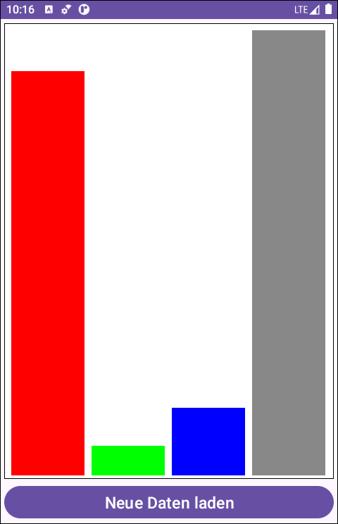

# Custom View in Android: Balkendiagramme anzeigen #

 

Das Repo enthält eine native Android-App (Java), die ein *Custom View* zur Anzeige eines einfachen Balkendiagramms enthält.

 

----

## Screenshot ##

 

 

----

## License ##

 

See the [LICENSE file](LICENSE.md) for license rights and limitations (BSD 3-Clause License).

 
